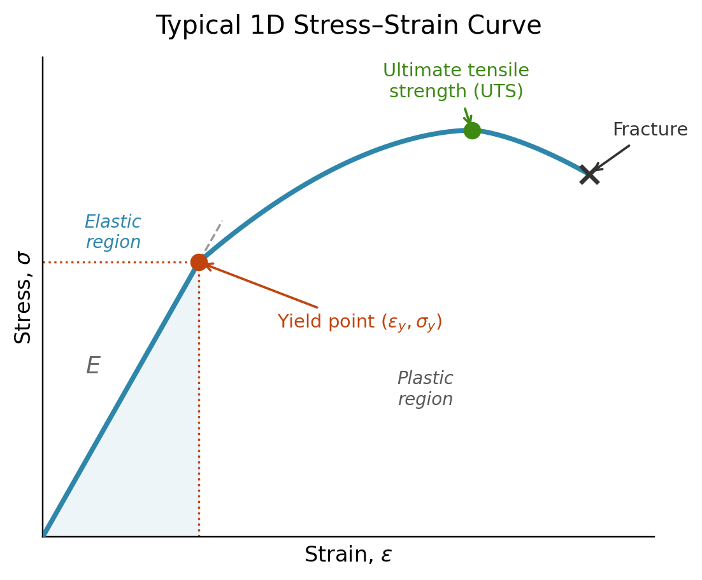

## Equivalent stress measures.

In 1d a typical stress-strain figure looks like the following:

{width=70%}

This is what experimentalists get when doing a tensile test. After a certain stress $\sigma_Y$, the behavior of the material is no longer purely elastic and the stress is no longer linearly dependent on the strain. The issue is that in a real material, we do not have uniaxial displacements and stresses, so the stress is a $3 \times 3$ tensor, but at which stress does it yield? This is where equivalent stress come into play, we use a scalar $\sigma_{eq} = f(\boldsymbol{\sigma})$ and compare it to the yield stress $\sigma_Y$ to determine if plastic deformation happen. There are a variety of equivalent stress measures that we can choose, but in this course we consider the Von-Mises and Tresca equivalent stress.

The Von-Mises equivalent stress measures (1.35 in the lecture notes):

$$
\sigma_{eM}(\sigma_{ij}) = \sqrt{\frac{3}{2}\sigma_{ij}^\text{dev}\sigma_{ij}^\text{dev}}
$$

One thing that should be noted is that this is a scalar value, and it is an invariant of the stress tensor, meaning that the Von-Mises stress is independent on the basis in which we express the components of the stress tensors. We will see in exercise 5 that the Von-Mises stress can be written in term of principal stress:

$$
\sigma_{vM} = \sqrt{\frac{1}{2}\left[(\sigma_1-\sigma_2)^2 + (\sigma_2-\sigma_3)^2 + (\sigma_3-\sigma_1)^2\right]}
$$

We also defined the Tresca criterion.
$$
\sigma_{\text{Tresca}} = \max\big(|\sigma_1-\sigma_2|,\ |\sigma_2-\sigma_3|,\ |\sigma_3-\sigma_1|\big) = \sigma_{max} - \sigma_{min}
$$

In the following cell, you can play around the two criterion and see when they differ.



The two criteria always agree at the hexagon's corners and diverge most at the
edge midpoints (pure-shear states), where Tresca is more conservative by $2/\sqrt{3}\approx1.155$.
