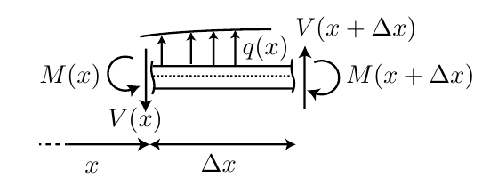
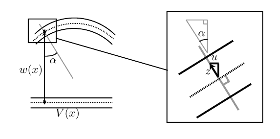

# In common between beams and bar models

The object we consider are that beam and bars are long compared to its cross-section. The also assume small deformations in both cases.

We write the displacement vector as

$$
\boldsymbol{u} = [u,v,w]^T
$$

In the bar model, we solve for the horizontal displacement $u = u(x)$, while in the beam models, we solve for the vertical displacement $w = w(x)$.

# Bar model

## Assumptions

We make a few assumptions in the bar model

- External force are in the x-directions ($K_x A$).
- Cross-section << Length. Stress is uniaxial $\boldsymbol{\sigma} = \sigma \hat{\boldsymbol{e}}_1  \hat{\boldsymbol{e}}_1$.
- Stress is homogeneous in the cross-section $\sigma = N/A$

## Equilibrium of forces

Writing the equilibrium of forces gives

$$
-\frac{dN}{dx} = K_x A
$$

## Differential equation

$$
-\frac{d}{dx}\left[ EA \frac{du}{dx}\right] = K_x A + \rho A \ddot{u}
$${#eq-dynamics_bar_equation}

Quasistatic formulation ($\dot{u} = 0$):

$$
-\frac{d}{dx}\left[ EA \frac{du}{dx}\right] = K_x A
$$

Possible boundary conditions:

1) Prescribed displacement $u = \hat{u}$ 
1) Prescribed normal force $N=\hat{N}$
1) Mixed condition e.g. $N=k u$

## Eigenmodes

Assume a solution to @eq-dynamics_bar_equation can be separated into two terms 

$$
u(x,t) = U(x) \sin(\omega t)
$$

Following the lecture notes

# Beam models

- External forces are in the z-direction (vertical).
- Cross-section << Length. Stress is not uniaxial, normal stress $\sigma_{xx}$ and shear stresses $\sigma_{xz}$.
- Stress vary linearly in the cross-section $\sigma_{xx} = -E z w''(x)$

## Equilibrium of forces

{width=70%}

Derivation during the lecture (or video lecture)

$$
\frac{dV}{dx} = - q(x)
$${#eq-EB_beam_shear}

$$
\frac{d M}{dx} = V(x)
$${#eq-EB_beam_moment}

## Kinematic assumption

The key assumption for an Euler-Bernoulli beam, with the consequence that the horizontal displacement is not free but depends on $w(x)$:

{width=70%}

$$
u(x,z) = -z w'(x)
$$

This assumption will be relaxed for Timoshenko's beams (Later in the course).

## Differential equation with boundary condition

$$
M(x) = \int_A \sigma(x,z) z dA = - EI w''(x)
$$

Which combined with @eq-EB_beam_moment and @eq-EB_beam_shear gives

$$
\frac{d^2}{d x^2} (EI w''(x)) = q(x)
$$

With $I = \int_A z^2 \; dA$. Special case when $EI$ (beam stiffness) is constant:

$$
EI \frac{d^4 w}{dx^4} = q(x)
$$

Possible boundary conditions:

1) Prescribed displacement $w = \hat{w}$
1) Prescribed rotation $w' = \hat{w}'$
1) Prescibred shear force $V = \hat{V}$
1) Prescribed moment $M = \hat{M}$

## Eigenmodes

Same idea as for the bar problem, assume a separable solution

$$
w(x) = W(x) \sin(\omega t)
$$

Resulting equation for $W$ with $q=0$:

$$
\frac{d^4 W}{d x^4} - \omega^2 \frac{\rho A}{EI} W = 0
$$

# Interactive widget with a cantilever beam/bar



# Eigenmodes interactive

