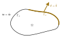

## The principle of virtual work against the strong form

Let $\Omega$ be a solid with boundary $\Gamma$. The main equation we are trying to solve **in this course** is, and always will be, the quasi-static force equilibrium equation:

$$
- \nabla \cdot \boldsymbol{\sigma} = \boldsymbol{f} 
$${#eq-solid_mechanics_equilibrium}

where $\boldsymbol{f}$ are the applied body forces and $\boldsymbol{\sigma}$ is the Cauchy stress tensor.  It is a very simple and elegant equation (until we introduce advanced constitutive models, but that's another course...). In addition, we have to set boundary conditions. The simplest ones are Dirichlet boundary conditions (set displacement $\boldsymbol{u} = \hat{\boldsymbol{u}}$), and Neumann boundary conditions (set traction $\boldsymbol{t} = \hat{\boldsymbol{t}}$), so let us partition our boundary in two non-intersecting parts: a Dirichlet part $\Gamma_u$ and a Neumann part $\Gamma_\sigma$ so that $\Gamma = \Gamma_u \cup \Gamma_\sigma$ as illustrated in @fig-continuum-potato.

{#fig-continuum-potato}

And then we have the principle of virtual work, which we get from the principle of minimum potential energy (for elasticity and conservative forces), or by multiplying @eq-solid_mechanics_equilibrium by $\delta \boldsymbol{u}$, integrating over the volume, using the divergence theorem, and using Cauchy's formula for the Neumann BC (Do it! It is one of the learning outcomes and can come up during the exam!).

:::{.callout-important title="Principle of virtual work"}
A solid $\Omega$ with boundary $\Gamma_u \cup \Gamma_\sigma$ is at equilibrium **if and only if** for any kinematically admissible virtual displacement $\delta \boldsymbol{u}$, we have that:

$$
\delta W_{\text{int}} = \delta W_\text{ext}
$${#eq-virtual_work_equilibrium}

where

$$
\delta W_\text{int} = \int_\Omega \sigma_{ij} \, \delta \varepsilon_{ij} \; d\Omega
$${#eq-internal_work}

and 

$$
\delta W_\text{ext} = \int_\Omega f_i \delta u_i \; d \Omega + \int_{\Gamma_{\sigma}} \hat{t}_i \, \delta u_i \; d \Gamma.
$${#eq-external_work}
:::

:::{.callout-note}
We have also implicitly defined the virtual strain associated with the virtual displacement as $\delta \varepsilon_{ij} = \frac{1}{2} \left(  \delta u_{i,j} + \delta u_{j,i} \right)$.
:::

WHAT?

### A virtual displacement??

A virtual displacement is, well...virtual. We do not actually displace the solid from its equilibrium positions and the forces and stress tensor are kept constant.

Think of a single particle with a net force $\boldsymbol{F}$ acting on it. Nudge it by
$\delta \boldsymbol{u}$: the work done by the force on the particle is $\boldsymbol{F} \cdot \delta \boldsymbol{u}$. Now, any nudge you apply is a combination of a set of three elementary nudges $\delta \boldsymbol{u} = \delta \hat{\boldsymbol{e}}_i$ for $i=1,2,3$. The work done by the force subjected to such an elementary nudge is then

$$
\delta W_i = \boldsymbol{F} \cdot \delta \hat{\boldsymbol{e}}_i = \delta F_i.
$$

Assume that you find $\delta W_i= 0$ in all three cases. Then $F_i = 0 \implies \boldsymbol{F} = \boldsymbol{0}$: the particle is in
equilibrium. The principle of virtual work is exactly this idea, applied to every point of the solid at once.

### Kinematically admissible??

By kinematically admissible we mean that the virtual displacement should not put the solid in an unphysical state. The most important consequence of this is that if we have a prescribed displacement on a region $\Gamma_u$, then the displaced body should still respect the prescribed displacement.

:::{.callout-important collapse="true" title="On $\Gamma_u$, what is a kinematically admissible virtual displacement?"}
$$
\delta \boldsymbol{u} = \boldsymbol{0} \; \text{on} \; \Gamma_u
$$

This is why the external work formulation @eq-external_work only has a surface integral on $\Gamma_\sigma$!
:::

A virtual displacement that introduces discontinuities, such as cracks or overlaps is also unphysical (we can actually handle cracks, but not in this course), so $\delta \boldsymbol{u}$ should be continuous. 

### How could that possibly be nicer than @eq-solid_mechanics_equilibrium ???

It turns out that the principle of virtual work is a very powerful framework to tackle solid mechanics problems, but its utility is sometimes difficult to see at first glance. I did not get the point especially at the start but over time I began to get it. In the lecture, you have seen its use notably to derive Timoshenko's beam model without having to write a local force equilibrium (and the appropriate boundary conditions as a two-for-one deal!), but there are other uses. Arguably one of the most useful properties of this framework is how simple @eq-virtual_work_equilibrium is. Here are some justifications (there are more but once again we will keep to the scope of the course):

1. We do not have any derivative on the stress tensor $\boldsymbol{\sigma}$ anymore. We only need to have the first derivative of $\boldsymbol{u}$.
1. The Neumann boundary condition appears naturally in the external virtual work (hence the sometimes used term "natural" boundary conditions).
1. It is an integral statement over the whole solid, while the differential equation has to be applied at every point.
1. It is straightforward to expand: most of the time we just add more terms to our virtual works!
1. Work is also something that, just like force, has a physical meaning: it is **energy**. If you are a physicist at heart, you love working with energy-like formulations, and especially work! For an elastic solid, the virtual work is just saying that for an imaginary displacement, the work of the real forces will be stored as elastic energy in the solid. 

The combination of all those points makes the formulation very convenient for simulations. You essentially have to find a displacement $\boldsymbol{u}$ such that, for any kinematically admissible virtual displacement $\delta \boldsymbol{u}$,

$$
R(\boldsymbol{u};\delta \boldsymbol{u}) = \delta W_{\text{int}} - \delta W_\text{ext} = 0.
$$

In addition, you must respect the Dirichlet boundary conditions, that is $\boldsymbol{u} = \hat{\boldsymbol{u}}$ on $\Gamma_u$.

If you are an applied mathematician at heart, you love this kind of formulation (even more if you like calculus of variations)! Of course, written as is, we cannot just put the principle of virtual work on a computer and tell it "solve!" because there is an infinity of kinematically admissible virtual displacements to play with. That's why we develop the finite element method (FEM) or similar techniques. We will not care about FEM just yet, that will come later.

## A bar example, with an interactive widget!

Okay, now that we introduced the principle of virtual work, we are going to use it. Consider a bar that is clamped at the left end and free at the right end. Let us apply the principle of virtual work.

### Kinematically admissible virtual displacement

First, we note that the bar can only displace in the horizontal direction, so any kinematically admissible virtual displacement must respect that, that is $\delta \boldsymbol{u}(x) = (\delta u(x), 0, 0)$. Therefore, the only virtual strain left is the normal virtual strain in the horizontal direction $\delta \varepsilon_{xx} = \frac{d \delta u}{dx}$. Furthermore, the bar is clamped at the left boundary, hence $\delta u (0) = 0$.

### Internal virtual work

Because we only have a uniaxial virtual strain, the internal virtual work becomes
$$
\delta W_\text{int} = \int_\Omega \sigma_{xx} \delta \varepsilon_{xx} d\Omega = \int_{0}^L \int_A \sigma_{xx} \delta \varepsilon_{xx} \; dA dx = \int_{0}^L N \delta \varepsilon_{xx} \; dx = \int_0^L N \frac{d\delta u}{dx} dx
$$

where $N = \int_A \sigma_{xx} \; dA$ is the internal normal force in the bar.

### External virtual work

The bar is loaded by a point force $P$ at the right end and is subjected to an axial distributed load $q(x)$. For a point load, you can use the usual work done by a force on a particle. The external virtual work is then

$$
\delta W_\text{ext} = \int_{0}^L q(x) \delta u(x)\; dx + P\delta u(L)
$$

### Choice of virtual displacement, and interactive figure

Assuming a uniform load $q$, the equilibrium solution for the normal force for this problem is given by

$$
N(x) = P + q(L-x).
$$

According to the principle of virtual work, the external virtual work should be equal to the internal virtual work no matter our choice of virtual displacement. In the following widget, you can choose different virtual displacements, including a non kinematically admissible one. See how only the equilibrium solution passes all the virtual displacement "tests".



### Using the principle of virtual work as a solver

As we highlighted before, the principle of virtual work is the basis on which the finite element method is built. We will not introduce FEM now, but will do something quite similar here. Suppose now that you do not have the equilibrium solution for the normal force, but you can always make a guess for the normal force of the form

$$
N(x) = A + B \frac{x}{L} + C \frac{x^2}{L^2}
$$

To find those 3 unknowns, you would need a few equations. Turns out that the principle of virtual work can help you generate those equations! Just think of 3 well thought out virtual displacements, and write out the PVW! Then you can find $A,B$, and $C$ that satisfy the 3 equations.

:::{.callout-warning collapse="true" title="I set three virtual displacements and I have found A,B and C, does that mean that I have found the equilibrium solution?"}
No! Since you have not tested with every possible virtual displacement, you cannot draw the conclusion. All you can say is that you found a solution that passes your specific tests. In this case, our guess will give us the equilibrium formula for the normal force, but that is specific to this problem. 
:::

In the following widget, you can play around with the value of $A$, $B$, and $C$ for different load situations until all the tests pass. When you set a non-uniform $q$, you will need the $C$ term. Use the graph showing the equilibrium line for each test to find $C$.

